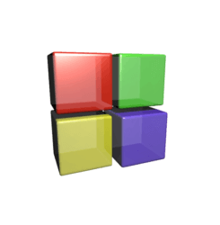

### Hi there
I'm Luca and I'm an italian developer.

## Some Stats
<!-- Aggiungere stats github e languages -->

  <a href="https://github.com/LucaR01">
  
  

  
### Tools and Languages
<!-- Immagini linguaggi e ide utilizzati. -->
  
## Languages
  

 
  
  
  
  
  
  
  
  
  
  
  
  
  
  
  
  
  

  
## Tools
  

 
  
  
  
  
  
  
  
  
  
  

  
## Operative Systems
  

 
  
  
  
  

### Some of the projects I worked on:
 
<!-- TODO: Quando metto la 4à repo allora mettere 120em o 100em -->
<!-- quando si clicca sui pin deve portare alla repository -->

  
  
  
  

